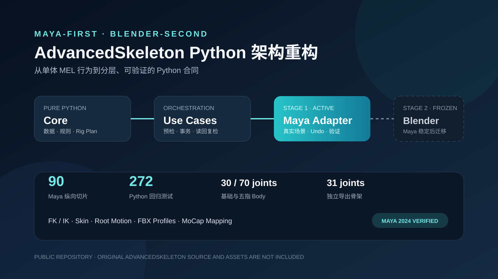

# AdvancedSkeleton Python 重构

将已授权 AdvancedSkeleton 安装中的绑定行为，逐步整理为分层 Python 工程。

当前开发顺序是 **Maya-first、Blender-second**：先在 Maya 中完成行为重建、事务边界和宿主验证，再把已经稳定的业务合同迁移到 Blender。仓库不包含 AdvancedSkeleton 原始 MEL、模板、图标、场景或文档。



> 包版本：`v0.96.0` · Windows · Maya 2024 standalone · Python 3.10 / 3.14
>
> Blender 5.2 仅保留早期架构可行性代码，第二阶段尚未开始。

## 当前版本

| 范围 | 已完成 |
| --- | --- |
| Maya 重构 | 102 个纵向切片，覆盖 Fit、Body、Arm / Leg / Hand FK/IK、Skin、Root Motion、FBX 与 MoCap 采样 / bake |
| 角色结构 | 30 关节基础 Body、70 关节五指 Body、31 关节独立导出骨架 |
| 数据合同 | FitSkeleton、Hand Pose 与 Skin Weight 使用路径无关的 JSON 文档和 SHA-256 内容摘要 |
| 写入边界 | 修改前预检；单一 Maya Undo 事务提交；执行后从场景读回复检 |
| 自动验证 | 308 项纯 Python 回归测试；90 个 Maya / Blender 宿主 smoke 脚本 |

当前 main 已在 v0.96.0 基础上加入躯干 / 颈头 FK、独立脊柱 IK/FK、双向姿态匹配与头部 / 手脚空间切换，调用方式见 [核心绑定架构](docs/核心绑定架构.md)。完整 Fit → Body → 控制 → 显式蒙皮入口见 [全身示例](examples/README.md)。本轮未新增版本发布。

[查看 v0.96.0 阶段说明](docs/阶段发布-v0.96.md)

## 解决的问题

原始工具的主要行为集中在大型 MEL 脚本中，过程调用、全局状态和动态 `eval` 使局部替换难以独立验证。本工程先建立只读清单，再按可运行纵切迁移：

1. 从明确输入生成 DCC 无关的计划和预检结果；
2. Application 层组织捕获、事务、写入和结果复检；
3. Maya Adapter 处理 DAG、DG、约束、关键帧和文件导出；
4. 通过自行生成的测试骨架与网格验证结果，不提交原始 ADV 资产。

`core` 不导入 `maya.cmds` 或 `bpy`。宿主差异保留在 Adapter 内，Blender 迁移只复用已经在 Maya 中稳定的语义合同。

## 已完成的工作流

### Fit 与 Body

- 创建、导出、导入和安全增量合并 FitSkeleton；
- 从 18 关节身体源构建 30 关节 Body；
- 从 38 关节五指源构建 70 关节 Body；
- 检查 provenance、外部连接与 ReBuild 删除边界。

### 角色控制与蒙皮

- 骨盆、腰、胸、颈、头及双侧肩胛 FK，衔接四肢起点和拉伸测量空间；
- 独立双段脊柱 IK/FK、连续混合、腰部 roll 与双向当前姿态匹配；
- 头部朝向及手脚 IK 的身体 / Global 空间选择，切换保持当前世界姿态；
- 双臂、双腿 FK/IK、匹配、显隐、stretch、twist 与 volume；
- Leg knee pin、stretch bias 与五级 reverse-foot；
- 双手 30 个 FK controls、curl / spread 聚合属性与 Hand Pose 预设；
- 显式 Skin Bind、权重编辑、JSON 往返和严格 X 平面对称镜像；
- 完整角色登记、只读恢复，保存重开后继续脊柱匹配与空间切换；
- 全身静态姿态 JSON、完整预演和单事务恢复，包含控制空间偏移及 Body 姿态复检。

### 动画与导出

- 全身当前帧写键、动画片段采样 / JSON / 批量恢复、已有动画上的脊柱 FK/IK 范围转换；
- 显式四肢长度 / 朝向补偿登记，标准身体动画的双侧臂腿 FK/IK 转换；动态拉伸匹配仍在开发，见 [四肢动画](docs/四肢动画开发记录.md)；

- Root Motion 实时输出与逐帧 bake；
- 31 关节独立 Export Skeleton 和完整 TRS bake；
- FBX2018 / FBX2020、Y/Z Up、cm/m、binary/ASCII 显式 Profile；
- MoCap 来源检查、显式 Body 映射、临时连接、断开，以及显式范围采样 / bake。

## 快速开始

### 1. 安装开发包

```powershell
git clone https://github.com/Ubik42/advanced-skeleton-python-refactor.git
cd advanced-skeleton-python-refactor
py -3 -m pip install -e .
```

仓库当前为私有项目，克隆需要对应 GitHub 访问权限。

### 2. 生成 MEL 只读清单

```powershell
adv-migrate inventory `
  D:\Downloads\AdvancedSkeleton\AdvancedSkeleton.mel `
  --output reports
```

`reports/` 默认不进入 Git，因为结果可能包含本机路径和专有过程名。

### 3. 运行纯 Python 回归

```powershell
$env:PYTHONPATH = "src"
py -3 -m unittest discover -s tests
```

### 4. 运行当前 Maya MoCap 验证

```powershell
& 'C:\Program Files\Autodesk\Maya2024\bin\mayapy.exe' `
  validation\maya_mocap_bake_smoke.py `
  validation\results\maya2024-mocap-bake.json
```

该脚本自行生成五关节 MoCap 来源和 30 关节 owned Body，将第 2–20 帧按步长 2 烘焙为 18 条动画曲线、180 个关键帧，检查采样姿态、关键帧读回、失败回滚、Undo / Redo 和删除来源后的回放。Maya 2024 后台实测 `status: passed`，耗时 4.318 秒。

更多宿主命令见 [后台宿主验证](validation/README.md)。

## 工程结构

```text
src/adv_migration/      MEL 清单与命令行入口
src/adv_py/core/        DCC 无关的数据、数学、计划与校验
src/adv_py/application/ 用例编排、事务和结果复检
src/adv_py/adapters/    Maya、Blender 与内存适配器
tests/                  不依赖 DCC 的快速回归测试
validation/             自生成场景和宿主 smoke 脚本
docs/                   架构、路线、调研与阶段说明
```

## 关键边界

- Maya 写入用例在修改前检查名称、对象类型、输入连接、锁定通道与产物归属；失败时不提交部分结构。
- 场景修改集中在单一 Undo Chunk，提交后重新读取节点、父级、连接和数值。
- Fit、Pose 与 Weight 文档不保存 Maya DAG 路径，文件写入使用临时文件复检和原子替换。
- FBX 发布使用明确选择集和拒绝覆盖策略；临时移除开发前缀及内部属性后恢复原场景。
- ReBuild 不能只依据名称删除对象；provenance、DAG 内容和外部 DG 连接必须同时满足条件。

## 当前未包含

完整工作包及完成条件见 [剩余开发清单](docs/剩余开发清单.md)，当前工程尚未完成全量替代。

- 产品 UI、自动角色发现和厂商 MoCap 自动映射表；
- 外部 FBX 自动导入、动画曲线简化和引擎专用骨名表；
- FitSkeleton 冲突覆盖、重父级、删除式同步与 ReBuild 脚本迁移；
- 非对称蒙皮镜像、自动手指权重与已有复杂蒙皮迁移；
- Blender 第二阶段的正式功能迁移。

## 文档

- [开发交接](docs/开发交接.md)
- [角色动画操作](docs/角色动画操作.md)
- [剩余开发清单](docs/剩余开发清单.md)
- [核心绑定架构](docs/核心绑定架构.md)
- [迁移架构](docs/迁移架构.md)
- [跨 DCC 路线](docs/跨DCC路线.md)
- [社区调研](docs/社区调研.md)
- [v0.96.0 阶段说明](docs/阶段发布-v0.96.md)
- [宿主验证命令](validation/README.md)

## 许可与源码边界

这是围绕本机已授权 AdvancedSkeleton 安装开展的私有研究与迁移工程。仓库仅保存独立 Python 实现、测试代码和自行生成的数据，不重新分发 AdvancedSkeleton 原始源码或资产。使用者需要分别遵守 AdvancedSkeleton、Autodesk Maya、Blender 及相关依赖的许可条款。

项目包元数据标记为 `Proprietary internal tooling`，当前未授权公开再分发。
