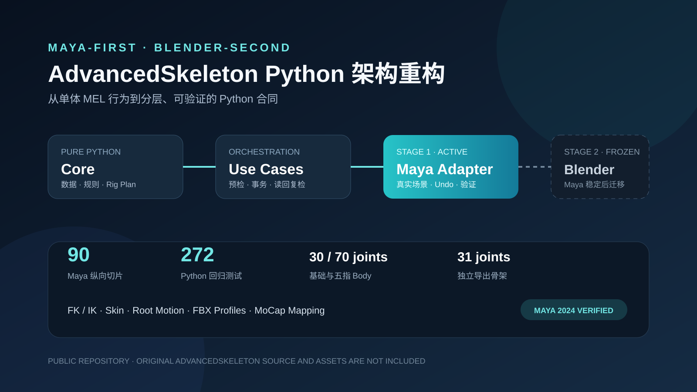

# AdvancedSkeleton Python 重构

将已授权 AdvancedSkeleton 安装中的绑定行为，逐步整理为分层 Python 工程。

当前开发顺序是 **Maya-first、Blender-second**：先在 Maya 中完成行为重建、事务边界和宿主验证，再把已经稳定的业务合同迁移到 Blender。仓库不包含 AdvancedSkeleton 原始 MEL、模板、图标、场景或文档。



> 包版本：`v0.96.0` · Windows · Maya 2024 standalone · Python 3.10 / 3.14
>
> Blender 5.2 仅保留早期架构可行性代码，第二阶段尚未开始。

## 当前版本

| 范围 | 已完成 |
| --- | --- |
| Maya 重构 | Fit、Body、Arm / Leg / Hand FK/IK、Skin、Root Motion、FBX、MoCap 控制重定向与基础 Face 工作流；真实覆盖与缺口见开发计划 |
| 角色结构 | 30 关节基础 Body、70 关节五指 Body、31 关节独立导出骨架 |
| 数据合同 | FitSkeleton、Hand Pose 与 Skin Weight 使用路径无关的 JSON 文档和 SHA-256 内容摘要 |
| 写入边界 | 修改前预检；单一 Maya Undo 事务提交；执行后从场景读回复检 |
| 自动验证 | 455 项纯 Python 回归测试；Maya 2024 后台场景与独立进程验收命令见 `validation/README.md` |

v0.96.0 加入躯干 / 颈头 FK、独立脊柱 IK/FK、双向姿态匹配、头部 / 手脚空间切换，以及不同脊柱段数角色的受控替换。调用方式见 [核心绑定架构](docs/核心绑定架构.md)，完整 Fit → Body → 控制 → 显式蒙皮入口见 [全身示例](examples/README.md)。当前仍是阶段版本，尚未完成 AdvancedSkeleton 全量复刻。

Maya 图形入口 `adv_py.product.maya_panel.show_panel()` 现按原版 AdvancedSkeleton 6.925 的顶层和子栏目顺序提供左侧折叠导航；已迁移操作从对应入口打开中文参数窗，其他栏目标明尚未实现。界面层级及真实 Maya 操作验收见 [Maya 可见界面验收](docs/Maya可见界面验收.md)。

从空场景开始时，可在 `Body / Fit` 创建基础身体或五指身体示例 Fit，调整关节位置，再在 `Body / Build` 指定网格并构建角色；这一模板入口不需要先制作 JSON 文件。

已有标准关节骨架时，先将其置于绑定姿态，选中根关节后在 `Body / Fit` 执行“从所选标准骨架创建 Fit”。入口读取中心和右侧的标准身体关节；具备五指链时同时读取手指。缺少的头顶末端、脚跟、脚尖末端和脚侧 Fit 标记按相邻关节位置生成。左侧由后续 Body 构建的镜像规则生成。来源关节只读；来源与当前目标同处一个命名空间时，Fit 自动建在新的 `AdvPy` 角色命名空间，面板切换到该角色。名称或父子结构不符合标准链时会明确报错。

也可在 `Body / Build` 记录来源根关节和待绑定网格，再执行“从来源骨架直接构建角色”：生成 Fit、Body、控制器和可选 Skin。来源骨架与当前目标位于同一命名空间时，会自动新建 `AdvPy` 角色命名空间；来源网格不属于目标角色时，会复制一份网格用于新 Skin，保留原网格。网格须尚未绑定 Skin。

`Body / Build` 可在构建 Fit 角色时填写多件未绑定网格，一次完成 Body、控制器、角色登记和新 Skin。面板默认请求创建四肢分段，以及骨架具备对应链时的标准躯干和手指末段影响关节；此项可关闭。基础与五指标准骨架的 Maya 后台构建、带 Skin 的动画 FBX 已跑通；图形面板点击尚未验收。新绑定仍使用 Maya Closest Distance，不等于原版完整权重；若要保留已有原版权重，应使用“迁移当前原版角色与蒙皮”。

发布 FBX 时选择“包含当前角色的已绑定网格与 Skin”，发布层会临时烘焙 Skin 实际使用的全部 Body 与分段影响关节；不包含 Skin 时仍按独立导出骨架发布。

从原版文件引用迁移出本地 `*_AdvPy` 角色后，可在面板的 `Publish` 页导出独立 `.mb` 角色场景。输出包含目标角色的网格、Skin、控制器和动画，不包含原版文件引用；当前工作场景仍保留来源引用。此入口已用单 Skin 与双 Skin 示例验收。

[查看 v0.96.0 阶段说明](docs/阶段发布-v0.96.md)

可变脊柱的身体描述、Fit 生成、全身 FK 与蒙皮验证见 [通用身体模块](docs/通用身体模块.md)。直线绑定的曲线 IK、伸展和体积保持已通过 1 / 4 / 8 段验证；通用登记、动画保存恢复与同布局重建已贯通；已支持曲线脊柱动画转 FK 与可表达姿态的 IK 反向拟合；弯曲绑定和拓扑变化迁移继续推进。

## 解决的问题

原始工具的主要行为集中在大型 MEL 脚本中，过程调用、全局状态和动态 `eval` 使局部替换难以独立验证。本工程先建立只读清单，再按可运行纵切迁移：

1. 从明确输入生成 DCC 无关的计划和预检结果；
2. Application 层组织捕获、事务、写入和结果复检；
3. Maya Adapter 处理 DAG、DG、约束、关键帧和文件导出；
4. 通过自行生成的测试骨架与网格验证结果，不提交原始 ADV 资产。

`core` 不导入 `maya.cmds` 或 `bpy`。宿主差异保留在 Adapter 内，Blender 迁移只复用已经在 Maya 中稳定的语义合同。

## 已完成的工作流

### Fit 与 Body

- 创建、导出、导入和安全增量合并 FitSkeleton；
- 从 18 关节身体源构建 30 关节 Body；
- 从 38 关节五指源构建 70 关节 Body；
- 检查 provenance、外部连接与 ReBuild 删除边界。

### 角色控制与蒙皮

- 骨盆、腰、胸、颈、头及双侧肩胛 FK，衔接四肢起点和拉伸测量空间；
- 独立双段脊柱 IK/FK、连续混合、腰部 roll 与双向当前姿态匹配；
- 头部朝向及手脚 IK 的身体 / Global 空间选择，切换保持当前世界姿态；
- 双臂、双腿 FK/IK、匹配、显隐、stretch、twist 与 volume；
- Leg knee pin、stretch bias 与五级 reverse-foot；
- 双手 30 个 FK controls、curl / spread 聚合属性与 Hand Pose 预设；
- 显式 Skin Bind、权重编辑、JSON 往返和严格 X 平面对称镜像；
- 完整角色登记、只读恢复，保存重开后继续脊柱匹配与空间切换；
- 全身静态姿态 JSON、完整预演和单事务恢复，包含控制空间偏移及 Body 姿态复检。

### 动画与导出

- 全身当前帧写键、动画片段采样 / JSON / 批量恢复、已有动画上的脊柱 FK/IK 范围转换；
- 显式四肢长度 / 朝向补偿登记，双侧臂腿 FK/IK 转换，支持动态拉伸与辅助骨骼 volume 保持，见 [拉伸匹配](docs/拉伸与体积动画匹配.md)；

- Root Motion 实时输出与逐帧 bake；
- 31 关节独立 Export Skeleton 和完整 TRS bake；
- FBX2018 / FBX2020、Y/Z Up、cm/m、binary/ASCII 显式 Profile；
- MoCap 来源检查、显式 Body 映射、临时连接、断开，以及显式范围采样 / bake。

## 快速开始

### 1. 获取工程

```powershell
git clone https://github.com/Ubik42/advanced-skeleton-python-refactor.git
cd advanced-skeleton-python-refactor
```

运行 Maya 宿主功能需要 Autodesk Maya 2024。

### 2. 在 Maya 中打开面板

在 Maya 的 Script Editor 切换到 Python，执行：

```python
import sys
sys.path.insert(0, r"C:\path\advanced-skeleton-python-refactor\src")
from adv_py.product.maya_panel import show_panel
show_panel()
```

将示例路径改为本机仓库的 `src` 目录。

### 3. 构建第一套角色

在 `Body / Fit` 创建示例 Fit，或选中已有标准骨架根关节后从骨架生成 Fit。调整 Fit 后，在 `Body / Build` 选中未绑定网格并填入，执行“构建并登记角色”；也可记录来源骨架根关节与网格，直接执行“从来源骨架直接构建角色”。随后在 `Body / Pose` 写入控制器关键帧，在 `Publish / FBX` 导出动画。

### 开发命令

```powershell
py -3 -m pip install -e .
$env:PYTHONPATH = "src"
py -3 -m unittest discover -s tests
adv-migrate inventory D:\Downloads\AdvancedSkeleton\AdvancedSkeleton.mel --output reports
```

`reports/` 默认不进入 Git，因为结果可能包含本机路径。尚未验收的新功能见 [开发计划](docs/开发计划.md)。

更多宿主命令见 [后台宿主验证](validation/README.md)。

已登记角色的后台发现、身体姿态／动画文档操作、预设检查及面部目标生成见 [后台产品入口](docs/后台产品入口.md)。这些操作通过 `mayapy -m adv_py.product` 在独立场景进程中运行。

## 工程结构

```text
src/adv_migration/      MEL 清单与命令行入口
src/adv_py/core/        DCC 无关的数据、数学、计划与校验
src/adv_py/application/ 用例编排、事务和结果复检
src/adv_py/adapters/    Maya、Blender 与内存适配器
tests/                  不依赖 DCC 的快速回归测试
validation/             自生成场景和宿主 smoke 脚本
docs/                   架构、路线、调研与阶段说明
```

## 关键边界

- Maya 写入用例在修改前检查名称、对象类型、输入连接、锁定通道与产物归属；失败时不提交部分结构。
- 场景修改集中在单一 Undo Chunk，提交后重新读取节点、父级、连接和数值。
- Fit、Pose 与 Weight 文档不保存 Maya DAG 路径，文件写入使用临时文件复检和原子替换。
- FBX 发布使用明确选择集和拒绝覆盖策略；临时移除开发前缀及内部属性后恢复原场景。
- ReBuild 不能只依据名称删除对象；provenance、DAG 内容和外部 DG 连接必须同时满足条件。

## 当前未包含

完整工作包及完成条件见 [开发计划](docs/开发计划.md)，当前工程尚未完成全量复刻，也没有足够证据声称原版源码行为已全部重建。

- 可见 Maya 会话中全部界面按钮的验收、原版界面对照及全身工作流入口收口；
- 生产资产的广泛拓扑兼容、外部目标网格版本管理与完整旧流程替代审计；
- 面部自动解剖标记定位、复杂表面的语义对应与自动配准、骨骼与曲线混合求解；
- 动捕与 FBX 在更广外部曲线条件下的兼容性，以及任意子帧连续误差验收；
- Blender 第二阶段的正式功能迁移。

## 文档

- [开发交接](docs/开发交接.md)
- [角色动画操作](docs/角色动画操作.md)
- [动画控制空间](docs/动画控制空间.md)
- [多角色与命名空间](docs/多角色与命名空间.md)
- [角色重建开发记录](docs/角色重建开发记录.md)
- [兼容与旧实现依赖清点](docs/兼容清点.md)
- [开发计划](docs/开发计划.md)
- [功能覆盖矩阵](docs/功能覆盖矩阵.md)
- [原版公开功能来源](docs/原版公开功能来源.md)
- [v0.96 历史验收记录](docs/历史验收记录-v0.96.md)
- [Maya 可见界面验收](docs/Maya可见界面验收.md)
- [核心绑定架构](docs/核心绑定架构.md)
- [迁移架构](docs/迁移架构.md)
- [跨 DCC 路线](docs/跨DCC路线.md)
- [社区调研](docs/社区调研.md)
- [v0.96.0 阶段说明](docs/阶段发布-v0.96.md)
- [宿主验证命令](validation/README.md)

## 许可与源码边界

这是围绕本机已授权 AdvancedSkeleton 安装开展的公开 Python 重构工程。仓库仅保存独立 Python 实现、测试代码和自行生成的数据，不重新分发 AdvancedSkeleton 原始源码或资产。使用者需要分别遵守 [AdvancedSkeleton 官方许可](https://www.animationstudios.com.au/EULA.html)、Autodesk Maya、Blender 及相关依赖的许可条款。

本仓库目前未提供开源许可证。公开阅读和克隆不等于获得修改后再分发本仓库代码的许可；如需这类许可，需另行明确。
